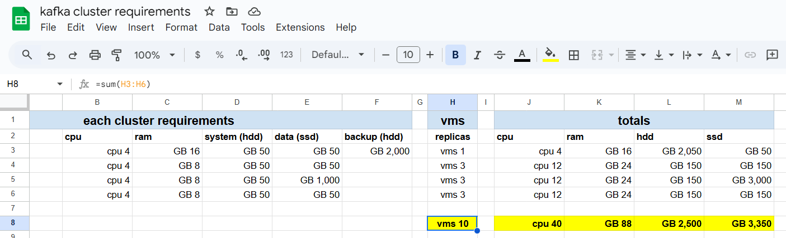

# **Kafka-Backup-Offline Utility**

## **Project Overview**

The `Kafka-Backup-Offline Utility` is a robust Bash-based tool designed to manage Kafka clusters in **development and
testing environments**. Its primary focus is to enable **safe and reliable cluster backups and restores** while
following proper startup and shutdown procedures to maintain data integrity.

This utility is **NOT SUITABLE FOR PRODUCTION USE**, as it requires taking the Kafka cluster offline during backup and
restore operations.

## **In general, Kafka Cluster deployment options are:**

| **Aspect**                  | **Cloud-Managed Services**   | **Kubernetes**                  | **Docker in VMs**      | **Binary in VMs**     | **Binary on Bare Metal**           | **Docker Compose**                   |
|-----------------------------|------------------------------|---------------------------------|------------------------|-----------------------|------------------------------------|--------------------------------------|
| **Overall Rating**          | ⭐⭐⭐⭐⭐                        | ⭐⭐⭐⭐⭐	                          | ⭐⭐⭐⭐                   | 	⭐⭐⭐	                 | ⭐⭐	                                | ⭐⭐                                   |
| **Definition**              | Fully managed Kafka services | Kafka operator in Kubernetes | Kafka in docker in VMs | Kafka binaries in VMs | Kafka binaries on physical servers | Kafka in containers on single docker |
| **Performance**             | ★★★★★ Excellent           | ★★★★ Good                    | ★★★★ Good           | ★★★★ Good          | ★★★★★ Excellent                 | ★★ Poor                           |
| **Performance Overhead**    | ★★★★★ Minimal             | ★★★ Medium                   | ★★★ Medium          | ★★★★ Moderate      | ★★★★★ None                      | ★★ High                           |
| **Operational Overhead**    | ★★★★★ Minimal             | ★★★★ Moderate                | ★★★ Medium          | ★★ High            | ★ Very High                     | ★★ High                           |
| **Operational Confidence**  | ★★★★★ High                | ★★★★ Good                    | ★★★★ Good           | ★★★ Moderate       | ★★ Low                          | ★★ Low                            |
| **Resource Isolation**      | ★★★★★ Strong              | ★★★★ Good                    | ★★★★ Good           | ★★★★ Good          | ★★★★★ Strong                    | ★ Very Weak                       |
| **Updates**                 | ★★★★★ Fully Automatic     | ★★★★ Helm or Operators       | ★★★ Docker images   | ★★ Manual          | ★ Manual                        | ★★★ Docker images                 |
| **Backup**                  | ★★★★★ Fully Automatic     | ★★ Requires tooling          | ★★ Manual           | ★★ Manual          | ★ Manual                        | ★ Manual                          |
| **Recovery**                | ★★★★ On demand            | ★★ Requires tooling          | ★★ Manual           | ★★ Manual          | ★ Manual                        | ★ Manual                          |
| **Scaling**                 | ★★★★★ Auto-scales         | ★★★★ Good                    | ★★★ Moderate        | ★★★ Moderate       | ★★ Poor                         | ★ Very Poor                       |
| **Flexibility**             | ★★★★ Good                 | ★★★★★ Excellent              | ★★★★ Good           | ★★ Poor            | ★★ Poor                         | ★★ Poor                           |
| **Automation**              | ★★★★★ Excellent           | ★★★★★ Excellent              | ★★★ Moderate        | ★★ Poor            | ★★ Poor                         | ★★ Poor                           |
| **Modern DevOps Practices** | ★★★★★ Excellent           | ★★★★★ Excellent              | ★★★ Moderate        | ★★ Poor            | ★ Very Poor                     | ★★ Poor                           |

If a cloud-managed service is not a viable option; and you prefer to avoid Kubernetes; your next best choice is to use
**virtual machines (VMs) and Docker inside them.**

In this setup, deploy Kafka nodes as containers within Docker and utilize **Kafka-Backup-Offline** to manage your Kafka
operations efficiently.

## Benefits of this Approach: ##

1. **Resource Isolation:** The use of VMs ensures that each Kafka node operates in its own isolated environment,
   reducing risks of interference or resource contention.  
2. **Data Confidence:** Kafka-Backup-Offline provides foolproof routines for automated backups and restores, offering
   unparalleled reliability and peace of mind.  
3. **Ease of Deployment:** With Kafka-Backup-Offline, deploying and managing Kafka containers becomes a simple,
   streamlined process, even for complex setups.  
4. **Cost Efficiency:** Running Kafka in Docker on VMs eliminates the need for a fully managed service or complex
   Kubernetes infrastructure, making it a cost-effective solution.  
5. **Portability:** Containers can easily be moved between environments, whether on different VMs, clouds, or
   on-premises servers.  
6. **Operational Flexibility:** You can customize VM and container configurations to suit your workload, scaling
   horizontally as needed by adding more VMs and Kafka nodes.  
7. **Improved Backup Retention:** Kafka-Backup-Offline supports backup retention policies, ensuring that older backups
   are rotated out while critical backups can be pinned and retained.  
8. **Disaster Recovery:** With automated restore routines, recovering from system failures becomes a fast and
   straightforward process.  
9. **Developer-Friendly:** The foolproof tools offered by Kafka-Backup-Offline make it easy for developers to work with
   the cluster, enhancing productivity and reducing the learning curve.  
10. **Minimal Downtime:** Routine backups and restores can be performed with minimal impact on cluster availability,
    ensuring smooth operations.

This approach provides flexibility, simplicity, and robust management of your Kafka environment while avoiding the
complexity of Kubernetes.

## **Cluster Deployment**

Kafka demands significant resources in terms of **Disk I/O, Memory & CPU**.

### Plan your resources!

## **Virtual Machines Setup**

- **Resource Recommendations**:
    - Ensure the VMs are provisioned with sufficient CPU, RAM and DISK to meet Kafka's
      workload demands.
- **Storage Considerations**:
    - **Avoid RAID-5** due to its high write latency, which can degrade Kafka performance.
    - Prefer configurations such as:
        - **Single SSD** for high performance.
        - **RAID-0** for performance without redundancy.
        - **RAID-10** for a balance of performance and redundancy.
    - Use **eagerzeroedthick** in ESXi (**Fixed Size Disk** in HyperV) provisioning for virtual disks to enhance I/O
      performance by pre-allocating disk space
      and avoiding fragmentation during write operations.

### **Cluster Roles**

The minimal development/testing cluster should include the following roles:

1. **Central node(s):**
    - Responsible for:
      - running any web console for GUI
      - backup & restore operations
      - certificate management operations
      - cluster management operations
      - in general, it's the control center
    - Mount (or bind via NFS) **Large size & Slow I/O** drive for **backup.**
    - To manage certificates, java is required
      - For centos `yum install java-11-openjdk-devel -y`
    - Includes at least one node (more nodes required for complex GUI options like [conduktor.io](https://conduktor.io/) which is resource hungry):
        - `kafka-central-1`

2. **Controllers**:
    - Responsible for managing cluster metadata, leader elections, and topic configurations.
    - Mount **Small size & Fast I/O** drive for **meta-data.**
    - Includes at least three controllers:
        - `kafka-controller-1`
        - `kafka-controller-2`
        - `kafka-controller-3`

3. **Brokers**:
    - Handle data storage, replication, and client requests.
    - Mount **Medium size & Fast I/O** drive for **data.**
    - Includes at least three brokers:
        - `kafka-broker-1`
        - `kafka-broker-2`
        - `kafka-broker-3`

once the virtual machines are up and runnig, lets see what the Kafka-Backup-Offline can offer you:

---

## Kafka-Backup-Offline Features

### Backup

- **Scheduled backups** for configurations and data
- **On-demand backups** for configurations or data

### Restore

- **On-demand restores** for configurations or data

### Container Management

- Run Kafka containers (execute docker run with params)
- Remove Kafka containers (execute docker rm with params)
- Start Kafka containers (execute docker start with params)
- Stop Kafka containers (execute docker stop with params)
- Restart Kafka containers (execute docker stop & start with params)

### Certificate management

- The management starts after certificates was generated by any tool, like certbot.
- Since we support dynamic amount of nodes, we better use wildcard certificates.
- The solution requires a few files to be present after the generation, in the example we will use such files, (they are not about to be commited and published, you will have to generate them by your own, consult letsencrypt on how to get those):
  - wildcard.intel.r7g.org-ACME.all.pem
  - wildcard.intel.r7g.org-ACME.ca
  - wildcard.intel.r7g.org-ACME.crt
  - wildcard.intel.r7g.org-ACME.fullchain
  - wildcard.intel.r7g.org-ACME.key 

## **Cluster Procedures**

### **Cluster Startup Procedure**

To ensure proper initialization and data consistency, the following **controlled startup sequence** is followed:

1. **Start Controllers**:
    - Start controllers one by one, beginning with the **first controller** and proceeding to the **last**.

2. **Start Brokers**:
    - Once all controllers are operational, start brokers one by one, beginning with the **first broker** and proceeding
      to the **last**.

---

### **Cluster Shutdown Procedure**

To safely shut down the cluster and maintain data consistency, the following **controlled shutdown sequence** is
followed:

1. **Stop Brokers**:
    - Stop brokers one by one, starting with the **last broker** and proceeding to the **first**.

2. **Stop Controllers**:
    - After all brokers are stopped, stop controllers one by one, starting with the **last controller** and proceeding
      to the **first**.

---

## **Backup Routine**

The utility provides a reliable method for performing **full cluster backups**. Below is an overview of the backup
routine:

### **Key Features**

1. **Backup Rotation**:
    - Automatically removes old backups based on a retention policy (default: 30 days).
    - Archives are stored in `STORAGE_COLD` (e.g., `/backup/cold`) and organized by timestamp.

2. **Backup Workflow**:
    - **Shutdown Routine**:
        - Gracefully shuts down the cluster following the controlled shutdown procedure (stop brokers first, then
          controllers).
    - **Cluster Configuration Backup**:
        - Pulls configuration files from all nodes to a temporary folder on the backup server.
        - Archives configuration files and moves them to cold storage.
        - Cleans up temporary folders to free up space.
    - **Cluster Data Backup**:
        - Archives data files locally on each node into temporary folders.
        - Transfers archived files from nodes to the backup server.
        - Consolidates individual node archives into a single "zip of zips" for the entire cluster and stores it in cold
          storage.
        - Cleans up temporary folders after the backup.
    - **Startup Routine**:
        - Restarts the cluster following the controlled startup procedure (start controllers first, then brokers).

---

## **How to Use**

### **Backup Command**

To perform a full cluster backup, use the following command: